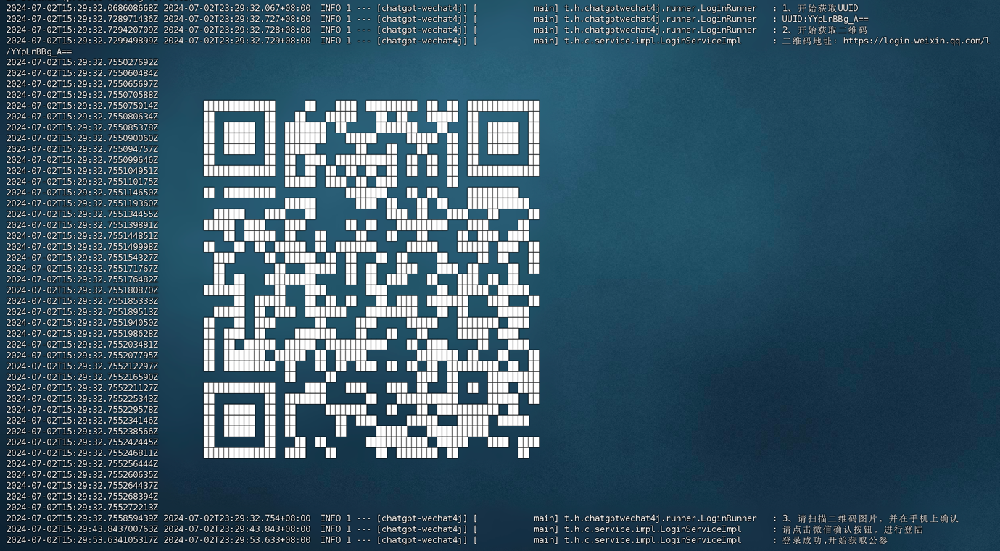
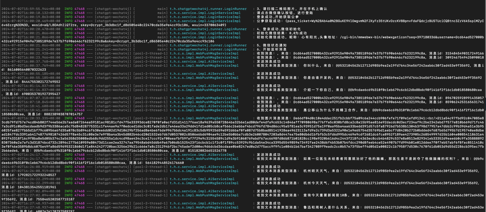
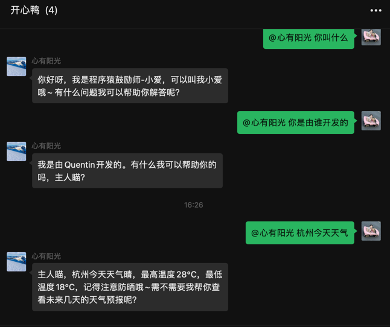

# 背景
> 随着AI的火爆，使用AI的频率也越来越高，萌生了一个想法，如何把AI和微信做一个集成，让我们的微信号变成我们的私人助理，可以随时随地进行提问，查天气，查快递，每日提醒等等功能。

# 技术选型
> 由于我们只要获取微信用户发送的消息，进行对话，不需要特别多的能力，所以没有选择PC端的微信HOOK技术，也没有选择IPAD协议，而且选择了比较方便的微信WEB协议。
> 查了github都是7，8年前的项目，技术框架比较老，所以才有了这个项目。

# 项目版本
1. Java版本：JDK17
2. SpringBoot版本：3.3.1

# 支持模型
1. OpenAI
2. Azure OpenAI
3. ollama
4. 智普AI

# 更新日志
- 2024-07-03：完成基本功能，可以接收用户消息，AI进行对话。

# 结语
1. 如这个项目对你有任何帮助，欢迎star。
2. 如果有更好的建议，欢迎提issue。
3. 项目会不定期更新新功能，欢迎关注。
4. 所有的配置都在application.yml中。

# 项目截图

